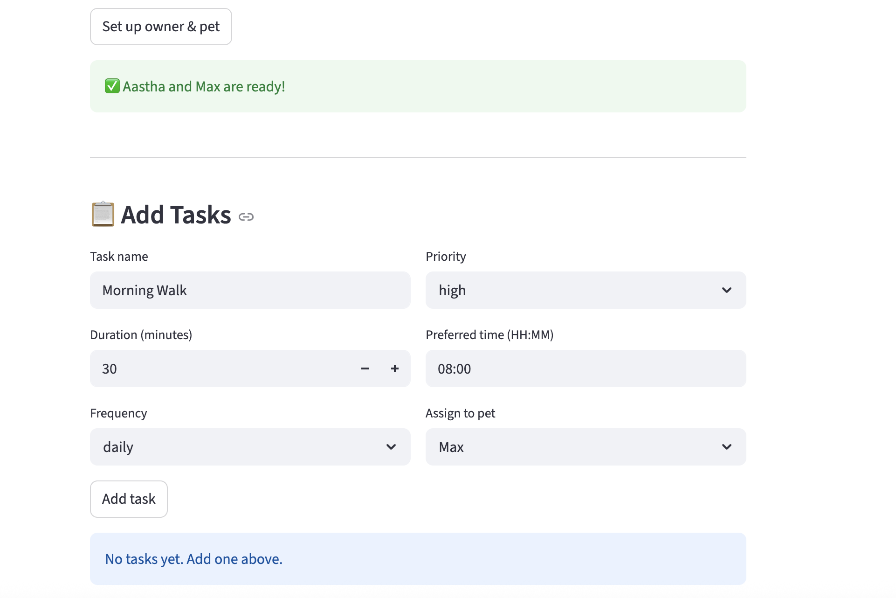

 PawPal+ (Module 2 Project)

**PawPal+** is a Streamlit app that helps a pet owner plan daily care tasks for their pet(s) based on constraints like time, priority, and preferences.

---

## 📸 Demo



---

## ✨ Features

- **Owner & Pet Setup** — Enter your name, available time, preferences, and pet info
- **Task Management** — Add care tasks with name, duration, priority, time, and frequency
- **Priority-Based Scheduling** — Generates a daily plan sorted by priority (high → medium → low)
- **Time Constraint Enforcement** — Only includes tasks that fit within the owner's available time
- **Conflict Detection** — Warns when two tasks are scheduled at the same time
- **Plan Explanation** — Displays a human-readable summary of the daily plan and reasoning

---

## 🧠 Smarter Scheduling

The scheduler uses the following algorithms:

- **Sorting by priority** using a custom key (`high → medium → low`)
- **Sorting by time** using Python's `sorted()` with a lambda on `HH:MM` strings
- **Filtering** tasks by pet name or completion status
- **Conflict detection** by checking for duplicate time slots across all tasks
- **Plan generation** that fits tasks within the owner's available time budget

---

## 🗂 Project Structure

```
pawpal_system.py   # Core logic: Task, Pet, Owner, Scheduler classes
app.py             # Streamlit UI
main.py            # CLI demo script
tests/
  test_pawpal.py   # Automated test suite
reflection.md      # Design and reflection writeup
```

---

## ⚙️ Setup

```bash
python3 -m venv .venv
source .venv/bin/activate
pip install -r requirements.txt
```

---

## ▶️ Run the App

```bash
streamlit run app.py
```

---

## 🧪 Testing PawPal+

```bash
python3 -m pytest tests/
```

### What the tests cover:
- ✅ Task completion status changes correctly after `mark_complete()`
- ✅ Adding a task to a pet increases its task count
- ✅ Tasks are returned in chronological order after sorting
- ✅ Conflict detection flags tasks scheduled at the same time
- ✅ Generated plan respects the owner's available time

### Confidence Level: ⭐⭐⭐⭐ (4/5)

The core scheduling behaviors are well tested. With more time I would add edge case tests for empty pet lists, tasks with identical priorities, and weekly recurrence logic.